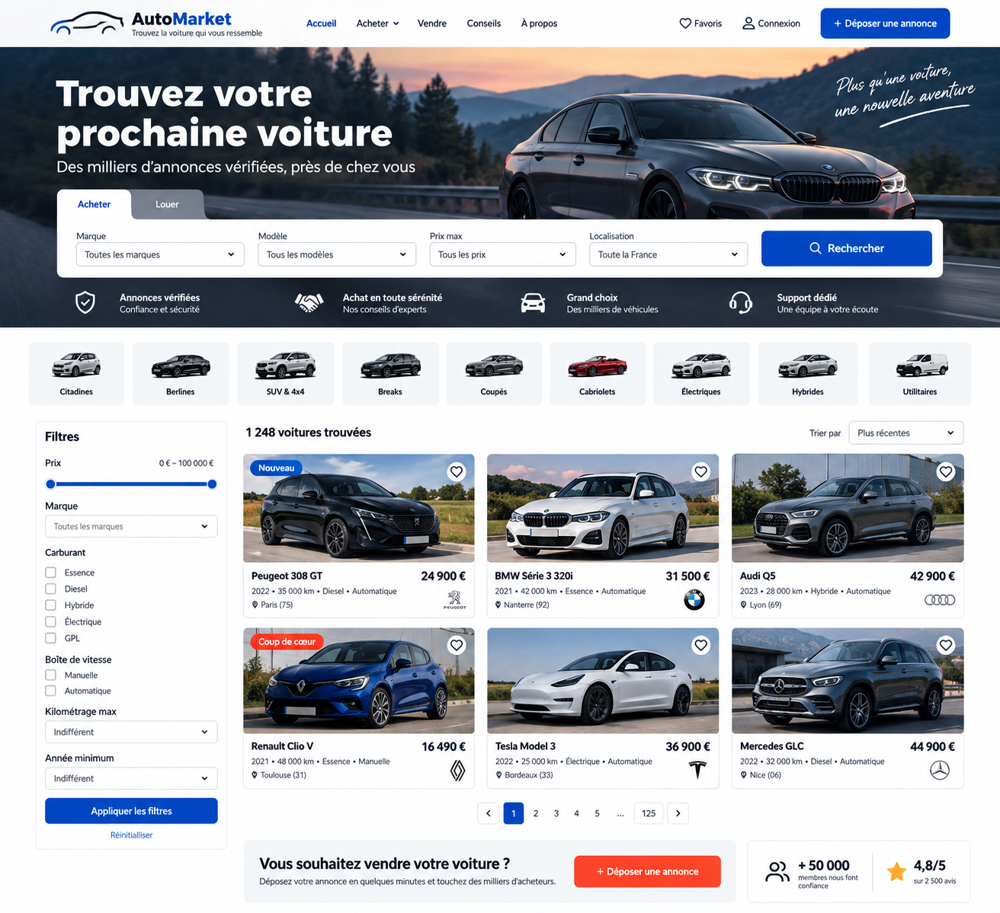

# 🚗 AutoMarket / SuperCar

AutoMarket is a web application designed to help users **search, filter, browse, buy, and sell used cars**.

The project is built with a **React / TypeScript frontend** and a backend responsible for managing vehicles, listings, users, and application data.

---

## 📸 Application Preview



---

## 1. Page Layout

The main page allows users to search for vehicles using several criteria and refine the results using advanced filters.

```text
┌─────────────────────────────────────────────────────────────────────┐
│ AutoMarket          Buy          Sell          Favorites       Login │
├─────────────────────────────────────────────────────────────────────┤
│                                                                     │
│                     Find your next car                              │
│                                                                     │
│    [ Brand ▼ ]    [ Model ▼ ]    [ Max Price ▼ ]    [ 🔍 Search ]  │
│                                                                     │
├────────────────┬────────────────────────────────────────────────────┤
│ FILTERS        │ 1,248 cars found                     Sort by ▼     │
│                │                                                    │
│ Brand          │ ┌────────────┐  Peugeot 308 GT                     │
│ [ Peugeot ]    │ │            │  2022 • 35,000 km • Diesel         │
│                │ │   PHOTO    │  Automatic                         │
│ Price          │ │            │                                    │
│ 5k ──●── 50k   │ └────────────┘  €24,900                      ♡    │
│                │                                                    │
│ Fuel           │ ────────────────────────────────────────────────   │
│ ☑ Petrol       │                                                    │
│ ☑ Diesel       │ ┌────────────┐  BMW 3 Series 320i                 │
│ ☐ Hybrid       │ │            │  2021 • 42,000 km • Petrol         │
│ ☐ Electric     │ │   PHOTO    │  Automatic                         │
│                │ │            │                                    │
│ Transmission   │ └────────────┘  €31,500                      ♡    │
│ ○ Manual       │                                                    │
│ ○ Automatic    │                                                    │
└────────────────┴────────────────────────────────────────────────────┘
```

---

## 2. Features

The application currently provides or is designed to provide the following features:

* Search vehicles by brand
* Search vehicles by model
* Filter by maximum price
* Filter by registration year
* Filter by fuel type
* Filter by transmission type
* Browse available vehicles
* View detailed vehicle information
* Add vehicles to favorites
* Create vehicle listings
* User authentication
* Responsive user interface

---

## 3. Project Structure

```text
supercar/
│
├── frontend/
│   │
│   ├── src/
│   │   │
│   │   ├── components/
│   │   │   ├── Navbar.tsx
│   │   │   ├── SearchBar.tsx
│   │   │   ├── FilterSidebar.tsx
│   │   │   └── CarCard.tsx
│   │   │
│   │   ├── pages/
│   │   │   ├── HomePage.tsx
│   │   │   ├── CarDetailPage.tsx
│   │   │   ├── CreateAd.tsx
│   │   │   └── Login.tsx
│   │   │
│   │   ├── models/
│   │   │   └── car.model.ts
│   │   │
│   │   ├── store/
│   │   │   ├── carSlice.ts
│   │   │   └── store.ts
│   │   │
│   │   ├── services/
│   │   │   └── carService.ts
│   │   │
│   │   ├── App.tsx
│   │   └── main.tsx
│   │
│   └── package.json
│
├── backend/
│   │
│   ├── controllers/
│   │
│   ├── routes/
│   │   └── carRoutes.js
│   │
│   ├── db/
│   │   └── database.js
│   │
│   ├── server.js
│   └── package.json
│
├── database/
│   └── schema.sql
│
├── documentation/
│   └── screen-shot.png
│
└── README.md
```

---

## 4. Frontend

The frontend is built with:

* React
* TypeScript
* Vite
* Redux Toolkit
* React Redux
* React Router
* Bootstrap
* React Bootstrap Icons

### Installation

Navigate to the frontend directory:

```bash
cd frontend
```

Install the dependencies:

```bash
npm install
```

### Development Server

Start the Vite development server:

```bash
npm run dev
```

The application will then be available through the local URL provided by Vite.

---

## 5. Routing

Client-side routing is handled using **React Router**.

Main application routes:

```text
/                 → Home page
/cars/:id         → Vehicle details
/create-ad        → Create a vehicle listing
/login            → User login
```

For example:

```text
/cars/2
```

opens the details page for the vehicle with ID `2`.

---

## 6. State Management

Global application state is managed using **Redux Toolkit**.

The Redux store manages vehicle data as well as the active search filters.

Example filter state:

```ts
{
  brand: "",
  model: "",
  maxPrice: undefined,
  minYear: undefined,
  maxYear: undefined,
  fuels: [],
  gearboxes: []
}
```

Components can update the filters using Redux actions:

```ts
dispatch(updateSearchFilters({
  brand: "BMW"
}));
```

Components subscribed to the store using `useSelector()` are automatically re-rendered when the relevant state changes.

---

## 7. Car Model

Vehicles are represented using the following TypeScript interface:

```ts
export interface Car {
  id: number;
  brand: string;
  model: string;
  year: number;
  mileage: number;
  fuel: string;
  gearbox: GearBox;
  price: number;
  location: string;
  image: string;
}
```

Transmission types are defined using a type-safe constant:

```ts
export const GearBox = {
  Manual: "MANUELLE",
  Automatic: "AUTOMATIQUE",
} as const;

export type GearBox =
  typeof GearBox[keyof typeof GearBox];
```

---

## 8. Application Architecture

The application follows a layered architecture:

```text
React Components
       ↓
      Pages
       ↓
  Redux Store
       ↓
    Services
       ↓
  Backend API
       ↓
    Database
```

### Components

Reusable UI elements such as:

* Navigation bar
* Search bar
* Vehicle cards
* Filter sidebar

### Pages

Application-level views such as:

* Home page
* Vehicle details
* Create listing
* Login

### Redux Store

Centralizes application state, including:

* Vehicle data
* Search criteria
* Active filters

### Services

Responsible for communication between the React application and the backend REST API.

### Backend

Provides the REST API used to manage vehicles, listings, and application data.

### Database

Stores persistent vehicle, listing, and user information.

---

## 9. Current Development Status

The project is currently under active development.

Current frontend implementation includes:

* Vehicle listing
* Search functionality
* Advanced filtering
* Redux state management
* Vehicle details page
* React Router integration

Upcoming development will include backend integration, persistent data storage, authentication, favorites, and vehicle listing management.
